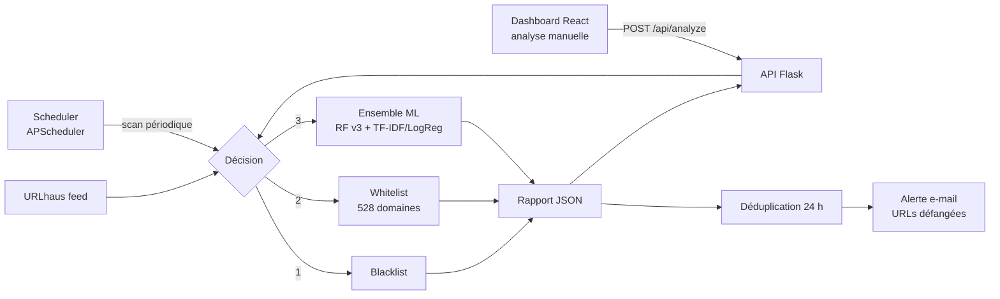

# Phishing URL Detection — Système de détection et d'alerte précoce

Système de détection d'URLs malveillantes combinant **renseignement sur les menaces**, **listes de confiance** et **apprentissage automatique**, conçu comme un outil d'alerte précoce pour les PME.

Réalisé dans le cadre d'un **stage PFA** (été 2026) au **CMRPI** — Centre Marocain de Recherches Polytechniques et d'Innovation.


---

## Résultats

| Métrique | Valeur |
|---|---|
| Accuracy de l'ensemble (RF v3 + TF-IDF/LogReg) | **96,91 %** |
| Taille du jeu de données | 651 191 URLs |
| Domaines de confiance (whitelist) | 528 |
| Endpoints de l'API REST | 10 |

---

## Fonctionnalités

- **Décision en trois couches** : blacklist → whitelist → modèle ML, pour combiner la fiabilité des listes avec la généralisation du ML.
- **Ensemble de deux modèles complémentaires** : un Random Forest sur 20 features structurelles de l'URL, et une régression logistique sur une représentation TF-IDF des tokens de l'URL.
- **Renseignement sur les menaces** : récupération automatique des URLs actives signalées par [URLhaus (abuse.ch)](https://urlhaus.abuse.ch/).
- **Scan planifié** : analyse automatique périodique, avec intervalle configurable depuis le dashboard.
- **Alerting par e-mail (SMTP)** : rapports envoyés avec les URLs **défangées** (`hxxp://`, `[.]`) pour qu'aucun lien ne soit cliquable, et **déduplication sur 24 h** pour éviter de re-signaler les mêmes menaces.
- **Dashboard React** de 5 vues (vue d'ensemble, alertes, historique, scanner, paramètres), au thème sombre « Analyst Workstation ».

---

## Architecture



L'ordre des couches est délibéré :

1. **Blacklist** : une URL déjà connue comme malveillante est signalée immédiatement, sans dépendre d'une prédiction.
2. **Whitelist** : les domaines de confiance sont acceptés avant le ML, ce qui élimine une source majeure de faux positifs (voir *Leçons techniques*).
3. **ML** : seules les URLs inconnues des deux listes sont soumises à l'ensemble de modèles.

L'analyse d'une URL isolée (dashboard) et l'analyse en masse (scan URLhaus) passent par la **même fonction**, `analyze_single_url()`, ce qui garantit des résultats identiques quel que soit le point d'entrée.

---

## Structure du projet

```
├── dashboard/              # Frontend React + Vite
│   └── src/
│       ├── components/     # Sidebar
│       ├── hooks/          # useCountUp (animations des compteurs)
│       └── pages/          # Overview, Alerts, History, ReportDetail, Scanner, Settings
├── data/
│   ├── whitelist_domains.txt       # 528 domaines de confiance
│   └── sample_alert_report.json    # Exemple de rapport (anonymisé)
├── models/                 # Modèles entraînés — à télécharger (voir Installation)
├── notebooks/              # Exploration, entraînement et évaluation des modèles
├── src/
│   ├── app.py              # API Flask + scheduler
│   ├── detector.py         # Pipeline de détection (3 couches + ensemble ML)
│   ├── text_features.py    # Tokenizer d'URL (requis pour charger le modèle TF-IDF)
│   ├── whitelist.py        # Vérification des domaines de confiance
│   ├── dedup.py            # Déduplication des alertes sur 24 h
│   ├── alerting.py         # Envoi des alertes par e-mail
│   ├── test_email.py       # Test de la configuration SMTP
│   └── .env.example        # Modèle de configuration
├── requirements.txt        # Dépendances de l'API
└── requirements-dev.txt    # + Jupyter, matplotlib, seaborn (notebooks)
```

---

## Installation

### Prérequis

- Python 3
- Node.js et npm
- Un compte Gmail avec un **mot de passe d'application** (pour les alertes e-mail)

### 1. Cloner le dépôt

```bash
git clone https://github.com/yasser-ch/Phishing-URL-Detection.git
cd Phishing-URL-Detection
```

### 2. Installer le backend

```bash
python -m venv venv

# Windows
venv\Scripts\activate
# Linux / macOS
source venv/bin/activate

pip install -r requirements.txt
```

> Les versions de `requirements.txt` sont figées volontairement. Les modèles ont été sérialisés avec **scikit-learn 1.9.0** : une autre version peut empêcher leur chargement ou fausser les prédictions.

### 3. Télécharger les modèles

Les modèles (≈ 616 MB décompressés) dépassent la limite de taille de GitHub et sont distribués via la page **[Releases](https://github.com/yasser-ch/Phishing-URL-Detection/releases/latest)**.

Téléchargez `models.zip`, vérifiez son intégrité avec le hash SHA-256 indiqué dans la release, puis extrayez-le dans `models/` :

```bash
# Windows (PowerShell)
Expand-Archive models.zip -DestinationPath models

# Linux / macOS
unzip models.zip -d models
```

Résultat attendu :

```
models/
├── rf_phishing_model_v3.pkl
└── tfidf_logreg_model.pkl
```

### 4. Configurer les alertes

```bash
# Windows
copy src\.env.example src\.env
# Linux / macOS
cp src/.env.example src/.env
```

Renseignez ensuite `SMTP_EMAIL`, `SMTP_PASSWORD` et `ALERT_RECIPIENT` dans `src/.env`. Vous pouvez vérifier la configuration avec :

```bash
python src/test_email.py
```

### 5. Lancer l'API

```bash
python src/app.py
```

L'API écoute sur `http://localhost:5000`, et le scan automatique démarre selon `SCAN_INTERVAL_MINUTES` (60 par défaut).

### 6. Lancer le dashboard

Dans un second terminal :

```bash
cd dashboard
npm install
npm run dev
```

Le dashboard est accessible à l'adresse affichée par Vite (par défaut `http://localhost:5173`).

---

## API REST

| Méthode | Endpoint | Description |
|---|---|---|
| `GET` | `/api/health` | État du service |
| `GET` | `/api/report` | Dernier rapport complet |
| `GET` | `/api/report/<report_id>` | Rapport spécifique par identifiant |
| `GET` | `/api/alerts` | Alertes du dernier rapport |
| `GET` | `/api/summary` | Statistiques du dernier rapport |
| `GET` | `/api/history` | Résumé des 20 derniers rapports |
| `POST` | `/api/scan` | Lance un scan URLhaus immédiat |
| `POST` | `/api/analyze` | Analyse une URL unique |
| `GET` | `/api/scheduler/status` | État et prochaine exécution du scan planifié |
| `POST` | `/api/scheduler/config` | Active, met en pause ou modifie l'intervalle du scan |

### Exemples

Analyser une URL :

```bash
curl -X POST http://localhost:5000/api/analyze \
  -H "Content-Type: application/json" \
  -d '{"url": "http://example.com/login"}'
```

Lancer un scan sur 50 URLs :

```bash
curl -X POST http://localhost:5000/api/scan \
  -H "Content-Type: application/json" \
  -d '{"limit": 50}'
```

Passer le scan planifié à 30 minutes :

```bash
curl -X POST http://localhost:5000/api/scheduler/config \
  -H "Content-Type: application/json" \
  -d '{"enabled": true, "interval_minutes": 30}'
```

### Format d'un rapport

Voir [`data/sample_alert_report.json`](data/sample_alert_report.json) :

```json
{
  "report_id": "CMRPI-20260829-023938",
  "generated_at": "2026-08-29T02:39:38.904404",
  "source": "URLhaus - Abuse.ch",
  "summary": {
    "total_analyzed": 4,
    "malicious_detected": 4,
    "new_malicious_detected": 2,
    "benign": 0,
    "detection_rate": "100.0%"
  },
  "alerts": [
    {
      "url": "hxxp://192.0.2[.]163:45781/i",
      "prediction": "MALICIOUS",
      "confidence": 100.0,
      "detection_method": "MACHINE LEARNING",
      "status": "online",
      "timestamp": "2026-08-29T02:39:38.877687",
      "is_new": true
    }
  ]
}
```

---

## Modèles et données

### Jeu de données

Les modèles sont entraînés sur le **[Malicious URLs Dataset](https://www.kaggle.com/datasets/sid321axn/malicious-urls-dataset)** (Kaggle, 651 191 URLs). Il n'est pas redistribué dans ce dépôt : téléchargez `malicious_phish.csv` et placez-le dans `data/` pour rejouer les notebooks. Il n'est **pas** nécessaire pour faire tourner l'API.

### Notebooks

| Notebook | Contenu |
|---|---|
| `01_phishing_detection` | Exploration des données et premier modèle |
| `02_threat_intelligence` | Intégration du flux URLhaus |
| `05_model_v3_features` | Random Forest v3 sur 20 features structurelles |
| `06_tfidf_model` | Modèle TF-IDF + régression logistique |
| `07_ensemble_v3_tfidf` | Ensemble des deux modèles — **96,91 %** |
| `08_model_v4_bias_fix` | Random Forest v4 avec augmentation de données (voir *Travaux en cours*) |

La numérotation reflète l'ordre de travail ; les étapes intermédiaires abandonnées n'ont pas été conservées.

Pour exécuter les notebooks :

```bash
pip install -r requirements-dev.txt
jupyter lab
```

---

## Leçons techniques

**Sérialisation des modèles et fonctions personnalisées.**
Le modèle TF-IDF utilise un tokenizer d'URL personnalisé. `joblib` sérialise une *référence* à cette fonction, pas son code : si elle est définie dans un notebook, le modèle ne peut plus être chargé ailleurs. Le tokenizer a donc été déplacé dans un module importable, `text_features.py`, qui doit être importé avant le chargement du modèle.

**Biais sur les domaines courts.**
Le modèle avait tendance à classer comme malveillants des domaines légitimes très courts (de nombreux grands sites ont des URLs minimalistes). En production, ce biais est neutralisé par la couche whitelist, placée avant le ML. Une correction au niveau du modèle par augmentation des données d'entraînement a été développée (v4, voir ci-dessous).

**Défangage des URLs dans les alertes.**
Ajouté à la suite d'un incident réel : une URL malveillante présente dans un e-mail d'alerte restait cliquable. Toutes les URLs envoyées par e-mail sont désormais neutralisées (`hxxp://`, `[.]`).

**Cohérence entre analyse unitaire et analyse en masse.**
Les deux chemins d'analyse avaient divergé et pouvaient produire des verdicts différents pour la même URL. Ils ont été unifiés autour d'une fonction unique, `analyze_single_url()`.

---

## Limites connues et pistes d'amélioration

Ce projet est un prototype de stage. Avant tout déploiement exposé à un réseau, les points suivants seraient à traiter :

- **Mode debug Flask actif** (`debug=True`) : le débogueur Werkzeug permet l'exécution de code arbitraire s'il est accessible. À désactiver et à remplacer par un serveur WSGI (Gunicorn, Waitress).
- **Absence d'authentification** : les endpoints qui déclenchent des actions (`/api/scan`, `/api/scheduler/config`) sont accessibles sans contrôle. Une authentification par clé d'API ou jeton serait nécessaire.
- **CORS ouvert à toutes les origines** : à restreindre à l'origine du dashboard.
- **Messages d'erreur détaillés** : les exceptions sont renvoyées telles quelles au client, ce qui peut divulguer des informations internes.
- **Stockage en fichiers JSON** : adapté au prototype, mais une base de données serait nécessaire pour un volume réel et pour des requêtes sur l'historique.

### Travaux en cours

Le **Random Forest v4** (`08_model_v4_bias_fix`) corrige le biais sur les domaines courts au niveau du modèle, par augmentation des données. Il n'a pas encore été évalué au sein de l'ensemble : le système livré utilise donc la v3, dont la performance est mesurée. L'étape suivante est de réévaluer l'ensemble v4 + TF-IDF et de basculer si les résultats le confirment.

---

## Auteur

**Yasser Chettour** — Élève ingénieur en Génie Cyberdéfense & Télécommunications Embarquées, ENSA Marrakech

- Portfolio : [yasser-ch.github.io](https://yasser-ch.github.io)
- GitHub : [@yasser-ch](https://github.com/yasser-ch)

Stage encadré au **CMRPI** par Pr. Mehdia Ajana et Pr. Youssef Bentaleb.
